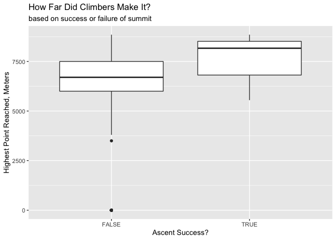
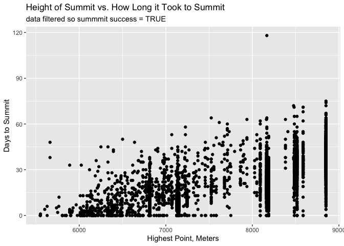

IDEAS:
Using a data set with climbers on famous peaks
-Mapping of where most deaths occur
-Ramifications of Climbing Traffic
-Largest Factors that drive death on the mountain


```r
library(foreign)
library(tidyverse)
```

```
## ── Attaching packages ─────────────────────────────────────────────────────────────── tidyverse 1.2.1 ──
```

```
## ✔ ggplot2 3.2.1     ✔ purrr   0.3.2
## ✔ tibble  2.1.3     ✔ dplyr   0.8.3
## ✔ tidyr   1.0.0     ✔ stringr 1.4.0
## ✔ readr   1.3.1     ✔ forcats 0.4.0
```

```
## ── Conflicts ────────────────────────────────────────────────────────────────── tidyverse_conflicts() ──
## ✖ dplyr::filter() masks stats::filter()
## ✖ dplyr::lag()    masks stats::lag()
```

```r
library(ggplot2)
```


```r
climberdata <- read.dbf("/Users/andrew/Desktop/STAT112/HIMDATA/exped.DBF")
```

This dataset includes data from over 10,000 climbs of high summits around the world. First, we made a graph showing the interquartile range of highest point reached during the climb, separated by climbers who reached or did not reach the summit

```r
climberdata %>%
  ggplot(aes(x = SUCCESS1, y = HIGHPOINT)) +
  geom_boxplot() +
  labs(x = "Ascent Success?", y = "Highest Point Reached, Meters", title = "How Far Did Climbers Make It?", subtitle = "based on success or failure of summit")
```

<!-- -->

We next looked at a variable that shows whether the climbers used oxygen to assist them in ascending to the summit. We found that just over 40% of successfull summiters used oxygen.

```r
climberdata %>%
  filter(SUCCESS1 == TRUE) %>%
  summarise(prop_o2 = sum(O2USED == TRUE)/sum(n()))
```

```
##     prop_o2
## 1 0.4008172
```

We also looked at how many days it took for successful summiters to achieve the summit. We see a predicted positive relationship in the graph. We also see bunches of data at equal "highest point" numbers, showing that there is lots of data for these specific peaks. We plan to investigate these peaks further.

```r
climberdata %>%
  filter(SUCCESS1 == TRUE) %>%
  ggplot(aes(x = HIGHPOINT, y = SMTDAYS)) +
  geom_point() +
  labs(x = "Highest Point, Meters", y = "Days to Summit", title = "Height of Summit vs. How Long it Took to Summit", subtitle = "data filtered so summmit success = TRUE")
```

<!-- -->

In progressing with our project, we plan to use a join function to join the previous dataset with the dataset below, which shows the specific peaks these climbers are attempting to summit. Both datasets share a PEAKID variable.

```r
peaksdata <- read.dbf("/Users/andrew/Desktop/STAT112/HIMDATA/peaks.DBF")
```
